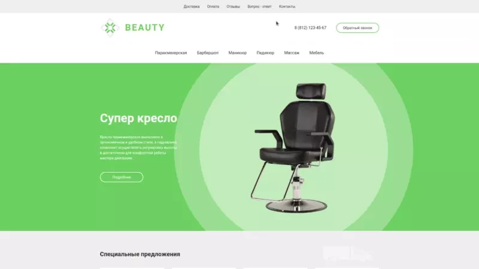
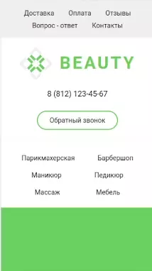
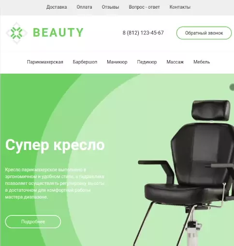

# BeautyStore

### Use Skills

---

[Demo Link  ](https://golovanovalex.github.io/BeautyStore_Figma_01/)

## Info

Создано на основе ролика с YouTube канала [Anna Blok](https://www.youtube.com/c/%D0%90%D0%BD%D0%BD%D0%B0%D0%91%D0%BB%D0%BE%D0%BA)

Верстка нескольких страниц сайта. Работа с **HTML**, **CSS**.  
Использование препроцессинга **SASS**, модуль гибкого контейнера **Flexbox**.
Сделана страница **404** и модульное окно **контактов**.
Пройдена валидация HTML и CSS.

---

Респонсивный дизайн адаптирует сайт под любой экран устройства.

 &nbsp;&nbsp;&nbsp;&nbsp;&nbsp;&nbsp;&nbsp;

---

## Contacts

- 📧 My Email: <a href="mailto:golovanov.a.a@yandex.ru" >Golovanov.a.a@yandex.ru</a>
- 📜 My Website: [alexgolovanov.ru](http://alexgolovanov.ru)

 Made with 💙
